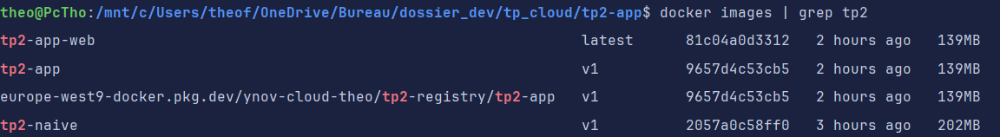
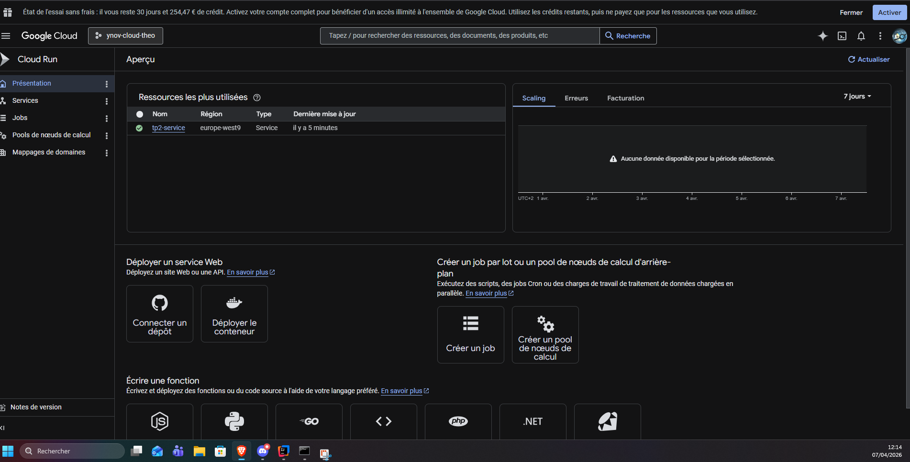

# TP 2 — Docker Avancé, Cloud Run & Networking GCP

## Cours 2 | Développer pour le Cloud | YNOV Campus Montpellier — Master 2

**Date :** 07/04/2026 | **Durée TP :** 3 h | **Plateforme :** Google Cloud Platform

```
Prérequis validés (Cours 1 ) :
```
```
Compte GCP actif, gcloud configuré
docker installé et fonctionnel
Application Flask tp1-app/ opérationnelle en local
```
**Objectifs de ce TP :**

```
Optimiser un Dockerfile avec le build multi-stage
Orchestrer une stack applicative avec Docker Compose (app + base de données)
Pousser une image vers Google Artifact Registry
Déployer l'application sur Cloud Run
Configurer un VPC avec sous-réseaux et règles de pare-feu
```
**Livrables attendus :**

```
URL publique de votre application déployée sur Cloud Run (accessible depuis internet)
```
https://tp2-service-573328088364.europe-west9.run.app/
```
Capture d'écran du terminal : docker images montrant la réduction de taille (standard vs multi-stage)
```

```
Capture d'écran : service Cloud Run actif dans la console GCP
```

```
Fichier docker-compose.yml fonctionnel
README.md expliquant l'architecture et les commandes
```
[README.md](README.md)


## Partie 1 — Docker Multi-Stage Build (30 min)

```
Le build multi-stage permet de séparer l'environnement de compilation de l'environnement de production , réduisant
drastiquement la taille de l'image finale.
```
### 1.1 — Comprendre le problème

Commençons par mesurer la taille d'une image "naïve".

Créez un nouveau dossier tp2-app/ avec une application Node.js + TypeScript :

```
tp2-app/src/index.ts :
```
```
import express, { Request, Response } from 'express';
```
```
const app = express();
const PORT = parseInt(process.env.PORT || '8080', 10 );
```
```
app.get('/', (req: Request, res: Response) => {
res.json({
message: 'Hello from YNOV Cloud TP2',
version: '2.0.0',
stage: process.env.APP_ENV || 'production',
});
});
```
```
app.get('/health', (req: Request, res: Response) => {
res.status( 200 ).json({ status: 'ok' });
```

#### });

```
app.listen(PORT, '0.0.0.0', () => {
console.log(`Server running on port ${PORT}`);
});
```
```
tp2-app/package.json :
```
#### {

```
"name": "tp2-app",
"version": "2.0.0",
"scripts": {
"build": "tsc",
"start": "node dist/index.js",
"dev": "ts-node src/index.ts"
},
"dependencies": {
"express": "^4.18.2"
},
"devDependencies": {
"@types/express": "^4.17.21",
"@types/node": "^20.11.5",
"typescript": "^5.3.3"
}
}
```
```
tp2-app/tsconfig.json :
```
#### {

```
"compilerOptions": {
"target": "ES2020",
"module": "commonjs",
"outDir": "./dist",
"rootDir": "./src",
"strict": true,
"esModuleInterop": true
}
}
```
**Dockerfile naïf** (tp2-app/Dockerfile.naive) :

```
FROM node: 20 -alpine
WORKDIR /app
COPY package*.json ./
RUN npm install # Installe TOUTES les dépendances (y compris devDependencies)
COPY..
RUN npm run build
CMD ["node", "dist/index.js"]
```
```
cd tp2-app
# Builder l'image naïve
docker build -f Dockerfile.naive -t tp2-naive:v.
```
```
# Mesurer la taille
```

```
docker images tp2-naive:v
# Notez la taille : 202 MB
```
### 1.2 — Dockerfile Multi-Stage

Maintenant créez le **vrai Dockerfile** (tp2-app/Dockerfile) avec deux stages :

#### # ============================================

```
# Stage 1 : Build — Environnement de compilation
# ============================================
FROM node: 20 -alpine AS builder
```
```
WORKDIR /app
```
```
# Copier les fichiers de dépendances
COPY package*.json ./
COPY tsconfig.json ./
```
```
# Installer TOUTES les dépendances (y compris dev pour compiler TypeScript)
RUN npm install
```
```
# Copier le code source TypeScript
COPY src/ ./src/
```
```
# Compiler TypeScript → JavaScript
RUN npm run build
```
```
# ============================================
# Stage 2 : Runtime — Image de production minimale
# ============================================
FROM node: 20 -alpine AS runtime
```
```
WORKDIR /app
```
```
# Copier uniquement package.json pour installer les dépendances de PRODUCTION
COPY package*.json ./
RUN npm ci --omit=dev # Flag pour exclure devDependencies (syntaxe npm v9+)
```
```
# Copier uniquement les fichiers compilés depuis le stage "build"
# Syntaxe : COPY --from=[NOM_STAGE] [SOURCE] [DEST]
COPY --from=build /app/dist ./dist
```
```
# Utilisateur non-root pour la sécurité
RUN addgroup -S appgroup && adduser -S appuser -G appgroup
USER appuser
```
```
EXPOSE 8080
ENV APP_ENV=production
ENV NODE_ENV=production
```
```
CMD ["node", "dist/index.js"]
```
```
# Builder l'image multi-stage
docker build -t tp2-app:v.
```

```
# Comparer les tailles
docker images | grep tp
# tp2-naive v1 202 MB
# tp2-app v1 139 MB
```
```
# Question : quelle est la réduction de taille en %?
# Calcul : (taille_naive - taille_multistage) / taille_naive * 100 = 31.19 %
```
**Question :** Pourquoi les outils de build (TypeScript, gcc, etc.) ne doivent-ils **pas** être présents dans l'image de production
?
```
Réponse :
les outils de build augmentent la taille de l'image et ajoute des dépendances inutiles en production.

```
### 1.3 — .dockerignore

Créez tp2-app/.dockerignore :

```
node_modules
dist
*.log
.env
.git # Exclure le dossier .git
*.md
Dockerfile*
docker-compose*
```
## Partie 2 — Docker Compose : Stack App + PostgreSQL (30 min)

```
Docker Compose orchestre plusieurs conteneurs en local. On simule ici un environnement de développement complet.
```
### 2.1 — Ajouter la connexion base de données

Modifiez tp2-app/src/index.ts pour ajouter une route /db :

```
import express, { Request, Response } from 'express';
import { Pool } from 'pg';
```
```
const app = express();
const PORT = parseInt(process.env.PORT || '8080', 10 );
```
```
// Pool de connexion PostgreSQL
const pool = new Pool({
host: process.env.DB_HOST || 'localhost',
port: parseInt(process.env.DB_PORT || '5432', 10 ),
database: process.env.DB_NAME || 'ynov_db',
user: process.env.DB_USER || 'ynov',
password: process.env.DB_PASSWORD || 'password',
});
```
```
app.get('/', (req: Request, res: Response) => {
res.json({ message: 'Hello from YNOV Cloud TP2', version: '2.1.0' });
});
```
```
app.get('/health', async (req: Request, res: Response) => {
try {
```

```
await pool.query('SELECT 1');
res.status( 200 ).json({ status: 'ok', database: 'connected' });
} catch (err) {
res.status( 503 ).json({ status: 'error', database: 'disconnected' });
}
});
```
```
app.get('/db', async (req: Request, res: Response) => {
try {
// Créer la table si elle n'existe pas et insérer une entrée
await pool.query(`
CREATE TABLE IF NOT EXISTS visits (
id SERIAL PRIMARY KEY,
visited_at TIMESTAMP DEFAULT NOW()
)
`);
await pool.query('INSERT INTO visits DEFAULT VALUES');
const result = await pool.query('SELECT COUNT(*) as total FROM visits');
res.json({ total_visits: parseInt(result.rows[ 0 ].total, 10 ) });
} catch (err) {
res.status( 500 ).json({ error: String(err) });
}
});
```
```
app.listen(PORT, '0.0.0.0', () => {
console.log(`Server listening on :${PORT}`);
});
```
Ajouter pg aux dépendances dans package.json :

```
# Dans le dossier tp2-app
npm install pg
npm install --save-dev @types/pg
```
### 2.2 — Écrire le fichier docker-compose.yml

Créez tp2-app/docker-compose.yml en complétant les blancs :

```
version: "3.9"
```
```
services:
# Service applicatif Node.js
web:
build:.
ports:
```
- "8080:8080" # Mapper le port 8080 local vers le port 8080 du conteneur
  environment:
- APP_ENV=development
- DB_HOST=db # Nom du service PostgreSQL (résolution DNS automatique par Docker)
- DB_PORT=5432
- DB_NAME=ynov_db
- DB_USER=ynov
- DB_PASSWORD=secret_password
  depends_on:
  db:


```
condition: service_healthy # Attendre que le healthcheck PostgreSQL soit healthy
networks:
```
- app-network

```
# Service PostgreSQL
db:
image: postgres:16-alpine
environment:
```
- POSTGRES_DB=ynov_db
- POSTGRES_USER=ynov
- POSTGRES_PASSWORD=secret_password
  volumes:
# Volume nommé pour la persistance des données
- postgres-data:/var/lib/postgresql/data
  healthcheck:
  test: ["CMD-SHELL", "pg_isready -U ynov -d ynov_db"]
  interval: 5s
  timeout: 5s
  retries: 5
  networks:
- app-network

```
# Définition des volumes nommés
volumes:
postgres-data:
```
```
# Définition du réseau dédié
networks:
app-network:
driver: bridge
```
**Question :** Pourquoi utilise-t-on condition: service_healthy plutôt que condition: service_started pour
depends_on?

```
Réponse :
condition: service_healthy garantit que le conteneur PostgreSQL est non seulement démarré, mais aussi prêt à accepter des connexions.
```
### 2.3 — Lancer et tester la stack

```
# Démarrer tous les services en arrière-plan
docker-compose up -d
```
```
# Vérifier l'état des services (doivent être "running" et "healthy")
docker-compose ps
```
```
# Tester l'application
curl http://localhost:8080/
curl http://localhost:8080/health
curl http://localhost:8080/db # Premier appel → total_visits: 1
curl http://localhost:8080/db # Second appel → total_visits: 2
```
```
# Voir les logs en temps réel
docker-compose logs -f
```
```
# Arrêter sans supprimer les volumes (données conservées)
docker-compose stop
```

```
# Arrêter ET supprimer les volumes (reset complet)
docker-compose down -v
```
## Partie 3 — Artifact Registry & Push de l'Image (20 min)

```
Artifact Registry est le registry privé de GCP. Il remplace Container Registry (gcr.io) et supporte Docker, Maven, npm,
Python, etc.
```
### 3.1 — Créer un repository Artifact Registry

```
# Créer un repository Docker dans Artifact Registry
# --repository-format=docker : type Docker
# --location : région GCP
gcloud artifacts repositories create tp2-registry \
--repository-format=docker \
--location=europe-west9 \
--description="Registry TP2 YNOV"
```
```
# Lister les repositories existants
gcloud artifacts repositories list
```
### 3.2 — Authentifier Docker avec Artifact Registry

```
# Configurer Docker pour utiliser gcloud comme credential helper
# europe-west9-docker.pkg.dev est l'endpoint Artifact Registry pour Paris
gcloud auth configure-docker europe-west9-docker.pkg.dev
```
```
# Vérifier la configuration dans ~/.docker/config.json
cat ~/.docker/config.json | grep -A3 "credHelpers"
```
### 3.3 — Tagger et pousser l'image

```
# Format du tag pour Artifact Registry :
# [REGION]-docker.pkg.dev/[PROJECT_ID]/[REPOSITORY]/[IMAGE]:[TAG]
```
```
PROJECT_ID=$(gcloud config get-value project)
IMAGE_TAG="europe-west9-docker.pkg.dev/${PROJECT_ID}/tp2-registry/tp2-app:v1"
```
```
echo "Image tag : ${IMAGE_TAG}"
```
```
# Tagger l'image locale avec le format Artifact Registry
docker tag tp2-app:v1 ${IMAGE_TAG}
```
```
# Pousser l'image
docker push ${IMAGE_TAG}
```
```
# Vérifier que l'image est bien dans le registry
gcloud artifacts docker images list \
europe-west9-docker.pkg.dev/${PROJECT_ID}/tp2-registry
```

## Partie 4 — Déploiement sur Cloud Run (20 min)

```
Cloud Run est le service PaaS serverless de GCP pour les conteneurs. Il scale automatiquement de 0 à N instances
selon le trafic, et vous ne payez qu'à l'usage.
```
### 4.1 — Déployer le service

```
PROJECT_ID=$(gcloud config get-value project)
IMAGE="europe-west9-docker.pkg.dev/${PROJECT_ID}/tp2-registry/tp2-app:v1"
```
```
gcloud run deploy tp2-service \
--image=${IMAGE} \
--region=europe-west9 \
--platform=managed \
--allow-unauthenticated \ # Autoriser les requêtes non authentifiées (accès public)
--port=8080 \
--memory=512Mi \
--cpu=1 \
--max-instances=3 \
--set-env-vars="APP_ENV=production"
```
```
# La commande retourne une URL publique du type :
# https://tp2-service-xxxxxxxxxx-ew.a.run.app
```
```
Note : Cloud Run ne peut pas se connecter directement à votre PostgreSQL local. Pour ce TP, le service /db
retournera une erreur de connexion — ce n'est pas un problème. On utilisera Cloud SQL en cours 4.
```
### 4.2 — Tester le déploiement

```
# Récupérer l'URL du service
SERVICE_URL=$(gcloud run services describe tp2-service \
--region=europe-west9 \
--format='value(status.url)')
```
```
echo "URL du service : ${SERVICE_URL}"
```
```
# Tester les endpoints
curl ${SERVICE_URL}/
curl ${SERVICE_URL}/health
```
```
# Vérifier les informations du service
gcloud run services describe tp2-service --region=europe-west9
```
**Question :** Quelle est la différence entre --max-instances=3 et --min-instances=1 dans Cloud Run?

```
Réponse :
--max-instances=3 limite le nombre maximum d'instances que Cloud Run peut créer pour gérer le trafic. Si la demande augmente, Cloud Run peut scaler jusqu'à 3 instances
```
### 4.3 — Observer le comportement de scale à zéro

```
# Ne pas envoyer de requêtes pendant 5 minutes, puis relancer
# Cloud Run réduit les instances à 0 après inactivité (cold start)
```
```
# Mesurer le temps de réponse après inactivité
```

```
time curl ${SERVICE_URL}/health
```
```
# Question : Combien de ms pour le premier appel (cold start)?
# Réponse :
real    0m0.216s
user    0m0.045s
sys     0m0.004s
```
```
# Combien de ms pour les appels suivants (warm)?
# Réponse :
real    0m0.212s
user    0m0.045s
sys     0m0.015s
```
## Partie 5 — Networking GCP : VPC & Firewall (20 min)

```
GCP crée un VPC "default" automatiquement. Pour des déploiements professionnels, on crée son propre VPC avec des
sous-réseaux isolés.
```
### 5.1 — Créer un VPC personnalisé

```
# Créer un VPC en mode custom (pas de sous-réseaux automatiques)
gcloud compute networks create tp2-vpc \
--subnet-mode=custom # custom ou auto?
```
```
# Créer un sous-réseau public (pour les services exposés à internet)
gcloud compute networks subnets create tp2-subnet-public \
--network=tp2-vpc \
--region=europe-west9 \
--range=10.10.1.0/24 # Utiliser le bloc CIDR 10.10.1.0/
```
```
# Créer un sous-réseau privé (pour les bases de données, non exposé)
gcloud compute networks subnets create tp2-subnet-private \
--network=tp2-vpc \
--region=europe-west9 \
--range=10.10.2.0/24
```
**Question :** Pourquoi sépare-t-on les ressources applicatives et les bases de données dans des sous-réseaux différents?

```
Réponse :
Séparer les ressources dans des sous-réseaux différents permet d'appliquer des règles de sécurité plus strictes sur les bases de données, qui ne doivent pas être exposées à internet.
```
### 5.2 — Règles de pare-feu (Firewall Rules)

```
# Règle 1 : Autoriser le trafic HTTP (port 80) depuis internet vers le sous-réseau public
gcloud compute firewall-rules create tp2-allow-http \
--network=tp2-vpc \
--direction=INGRESS \
--action=ALLOW \
--rules=tcp:80 \
--source-ranges=0.0.0.0/0 \
--target-tags=http-server
```
```
# Règle 2 : Autoriser le trafic HTTPS (port 443)
gcloud compute firewall-rules create tp2-allow-https \
--network=tp2-vpc \
--direction=INGRESS \
--action=ALLOW \
--rules=tcp:443 \
--source-ranges=0.0.0.0/0 \
```

```
--target-tags=http-server
```
```
# Règle 3 : Autoriser PostgreSQL (port 5432) UNIQUEMENT depuis le sous-réseau applicatif
gcloud compute firewall-rules create tp2-allow-postgres \
--network=tp2-vpc \
--direction=INGRESS \
--action=ALLOW \
--rules=tcp:5432 \
--source-ranges=10.10.1.0/24 # Uniquement depuis 10.10.1.0/24 (subnet public)
--target-tags=db-server
```
```
# Lister les règles de firewall du VPC
gcloud compute firewall-rules list --filter="network=tp2-vpc"
```
**Question :** Quelle est la différence entre un Security Group (AWS) et une Firewall Rule (GCP)?

```
Réponse :
Un Security Group (AWS) est un pare-feu virtuel qui contrôle le trafic entrant et sortant au niveau de l'instance, tandis qu'une Firewall Rule (GCP) est une règle de pare-feu qui s'applique au niveau du réseau VPC et peut cibler des instances via des tags ou des plages d'adresses IP.
```
### 5.3 — Nettoyage du VPC

```
# Supprimer dans l'ordre inverse (les règles avant le VPC)
gcloud compute firewall-rules delete tp2-allow-http --quiet
gcloud compute firewall-rules delete tp2-allow-https --quiet
gcloud compute firewall-rules delete tp2-allow-postgres --quiet
gcloud compute networks subnets delete tp2-subnet-public --region=europe-west9 --quiet
gcloud compute networks subnets delete tp2-subnet-private --region=europe-west9 --quiet
gcloud compute networks delete tp2-vpc --quiet
```
```
echo "Nettoyage VPC terminé"
```
## Partie 6 — Cloud Storage Avancé : Versioning & Lifecycle (20 min)

```
En production, on ne supprime jamais accidentellement des fichiers. Le versioning et les règles de lifecycle protègent
les données et optimisent les coûts.
```
### 6.1 — Bucket avec versioning activé

```
PROJECT_ID=$(gcloud config get-value project)
BUCKET="ynov-tp2-versioned-${PROJECT_ID}"
```
```
# Créer un bucket avec versioning activé dès la création
gcloud storage buckets create gs://${BUCKET} \
--location=europe-west9 \
--uniform-bucket-level-access # Contrôle d'accès unifié (recommandé)
```
```
# Activer le versioning sur le bucket
gcloud storage buckets update gs://${BUCKET} \
--versioning # Flag pour activer le versioning
```
```
# Vérifier
gcloud storage buckets describe gs://${BUCKET} \
--format="value(versioning.enabled)"
# Résultat attendu : True
```

### 6.2 — Tester le versioning

```
# Créer et uploader un fichier
echo "Version 1 - $(date)" > config.json
gcloud storage cp config.json gs://${BUCKET}/
```
```
# Modifier et uploader une nouvelle version
echo "Version 2 - $(date)" > config.json
gcloud storage cp config.json gs://${BUCKET}/
```
```
# Uploader une 3ème version
echo "Version 3 - $(date)" > config.json
gcloud storage cp config.json gs://${BUCKET}/
```
```
# Lister TOUTES les versions (y compris les anciennes)
gcloud storage ls -a gs://${BUCKET}/config.json
```
```
# Question : combien de versions voyez-vous?
# Réponse : 3 version
gs://ynov-tp2-versioned-ynov-cloud-theo/config.json#1775559174017340
gs://ynov-tp2-versioned-ynov-cloud-theo/config.json#1775559210637184
gs://ynov-tp2-versioned-ynov-cloud-theo/config.json#1775559244757592
```
```
# Lire une ancienne version via son génération (numéro affiché dans ls -a)
# gcloud storage cp "gs://${BUCKET}/config.json#[NUMERO_GENERATION]" ./config_v1.json
```
### 6.3 — Règles de lifecycle automatisées

```
# Créer un fichier de règles lifecycle (JSON)
cat > lifecycle.json << 'EOF'
{
"lifecycle": {
"rule": [
{
"action": { "type": "Delete" },
"condition": {
"numNewerVersions": 3,
"isLive": false
}
},
{
"action": {
"type": "SetStorageClass",
"storageClass": "NEARLINE"
},
"condition": {
"age": 30,
"isLive": true
}
}
]
}
}
EOF
```
```
# Appliquer les règles lifecycle au bucket
gcloud storage buckets update gs://${BUCKET} \
```

```
--lifecycle-file=lifecycle.json
```
```
# Vérifier les règles appliquées
gcloud storage buckets describe gs://${BUCKET} \
--format="json(lifecycle)"
```
**Question :** Expliquez les deux règles lifecycle configurées ci-dessus. Quel est l'intérêt économique de passer en classe
NEARLINE après 30 jours?

```
Règle 1 :
Supprimer automatiquement les versions anciennes (non-live) si plus de 3 versions plus récentes existent. 
Cela nettoie les très vieux snapshots tout en conservant un historique de 3 versions pour la récupération d'urgence.

Règle 2 :
Convertir les fichiers actuels (live) au stockage NEARLINE après 30 jours. NEARLINE coûte 50% moins cher 
que STANDARD mais avec une latence d'accès légèrement plus élevée (~250ms vs <100ms).

Intérêt économique :
Passer en NEARLINE après 30 jours permet de réduire les coûts de stockage pour les données qui sont moins fréquemment accédées, tout en conservant la possibilité de les récupérer rapidement si nécessaire.
```
### 6.4 — Nettoyage

```
# Supprimer TOUTES les versions (y compris les non-live)
gcloud storage rm -r --all-versions gs://${BUCKET}
```
## Partie 7 — Cloud Run Avancé : Révisions & Traffic Splitting (20 min)

```
Cloud Run gère des révisions (snapshots immuables d'un déploiement). On peut router le trafic entre plusieurs
révisions pour des déploiements progressifs.
```
### 7.1 — Déployer une nouvelle révision

On simule une mise à jour applicative en changeant une variable d'environnement (sans changer le code).

```
PROJECT_ID=$(gcloud config get-value project)
IMAGE="europe-west9-docker.pkg.dev/${PROJECT_ID}/tp2-registry/tp2-app:v1"
```
```
# Déployer une "v2" avec une variable d'environnement différente
# --no-traffic : la nouvelle révision ne reçoit PAS de trafic immédiatement
gcloud run deploy tp2-service \
--image=${IMAGE} \
--region=europe-west9 \
--no-traffic \
--set-env-vars="APP_ENV=production,APP_VERSION=2.0.0" \
--tag=v2 # Tag pour identifier cette révision
```
```
# Lister les révisions
gcloud run revisions list \
--service=tp2-service \
--region=europe-west9
```
### 7.2 — Traffic Splitting (déploiement Canary)

```
# Router 80% du trafic vers la révision stable, 20% vers la nouvelle
# Récupérer les noms des 2 dernières révisions
REV_STABLE=$(gcloud run revisions list \
--service=tp2-service --region=europe-west9 \
--format="value(name)" | sed -n '2p') # 2ème = ancienne
```
```
REV_CANARY=$(gcloud run revisions list \
```

```
--service=tp2-service --region=europe-west9 \
--format="value(name)" | sed -n '1p') # 1ère = dernière (canary)
```
```
echo "Stable : ${REV_STABLE}"
echo "Canary : ${REV_CANARY}"
```
```
# Diviser le trafic : 80% stable, 20% canary
gcloud run services update-traffic tp2-service \
--region=europe-west9 \
--to-revisions="${REV_STABLE}=80,${REV_CANARY}=20"
```
```
# Vérifier la répartition du trafic
gcloud run services describe tp2-service \
--region=europe-west9 \
--format="yaml(status.traffic)"
```
### 7.3 — Tester la répartition

```
SERVICE_URL=$(gcloud run services describe tp2-service \
--region=europe-west9 --format='value(status.url)')
```
```
# Envoyer 10 requêtes et observer quelle version répond
for i in $(seq 1 10); do
curl -s ${SERVICE_URL}/ | python3 -c "import sys,json; d=json.load(sys.stdin);
print(d.get('stage','?'))"
done
```
```
# Question : sur 10 requêtes, combien environ ont reçu APP_VERSION=2.0.0?
# Résultat observé :
# Explication mathématique (20% de 10 requêtes) :
10 * 0.20 = 2 requêtes (en moyenne)
```
### 7.4 — Basculer 100 % vers la nouvelle révision (promotion)

```
# Après validation : envoyer 100% du trafic vers la canary
gcloud run services update-traffic tp2-service \
--region=europe-west9 \
--to-latest
```
```
# Vérifier
gcloud run services describe tp2-service \
--region=europe-west9 \
--format="yaml(status.traffic)"
```
**Question :** Pourquoi le traffic splitting est-il préférable à un redéploiement direct (--to-latest immédiat) en production
?

```
Réponse : Le traffic splitting est préférable à --to-latest car il permet de détecter les bugs sur un pourcentage minoritaire d'utilisateurs avant de les affecter tous.
```
## Partie 8 — Docker Compose : Ajouter un Cache Redis (20 min)

```
Les applications cloud utilisent souvent un cache en mémoire pour réduire la charge sur la base de données et
accélérer les réponses.
```

### 8.1 — Ajouter Redis au docker-compose.yml

Modifiez tp2-app/docker-compose.yml pour ajouter un service Redis :

```
# Ajouter ce service après "db:"
cache:
image: redis:7-alpine # Utiliser la version 7
command: redis-server --maxmemory 128mb --maxmemory-policy allkeys-lru
ports:
```
- "6379:6379"
  healthcheck:
  test: ["CMD", "redis-cli", "ping"]
  interval: 5s
  timeout: 3s
  retries: 3
  networks:
- app-network

Ajouter la variable d'environnement Redis dans le service web :

```
environment:
```
- REDIS_HOST=cache # Nom du service cache
- REDIS_PORT=6379

Et ajouter la dépendance :

```
depends_on:
db:
condition: service_healthy
cache: # Dépendre aussi du service cache
condition: service_healthy
```
### 8.2 — Ajouter la route /cached dans l'application

Ajoutez dans src/index.ts :

```
import { createClient } from 'redis';
```
```
const redisClient = createClient({
socket: {
host: process.env.REDIS_HOST || 'localhost',
port: parseInt(process.env.REDIS_PORT || '6379', 10 ),
},
});
```
```
redisClient.connect().catch(console.error);
```
```
app.get('/cached', async (req: Request, res: Response) => {
const CACHE_KEY = 'visit_count_cached';
const TTL_SECONDS = 10 ;
```
```
try {
// Lire depuis le cache Redis
const cached = await redisClient.get(CACHE_KEY);
```

```
if (cached !== null) {
return res.json({
total_visits: parseInt(cached, 10 ),
source: cache, // "cache" si lu depuis Redis
ttl_remaining: await redisClient.ttl(CACHE_KEY),
});
}
```
```
// Cache miss : lire depuis PostgreSQL
const result = await pool.query('SELECT COUNT(*) as total FROM visits');
const count = parseInt(result.rows[ 0 ].total, 10 );
```
```
// Stocker dans Redis avec TTL de 10 secondes
await redisClient.setEx(CACHE_KEY, TTL_SECONDS, String(count));
```
```
return res.json({
total_visits: count,
source: database, // "database" si lu depuis PostgreSQL
});
} catch (err) {
return res.status( 500 ).json({ error: String(err) });
}
});
```
Installer le client Redis :

```
# redis v4+ inclut ses propres types TypeScript — @types/redis n'existe plus
npm install redis
```
### 8.3 — Tester le cache

```
docker-compose up -d --build
```
```
# Première requête → source: "database" (cache froid)
curl http://localhost:8080/cached
```
```
# Requêtes suivantes dans les 10 secondes → source: "cache"
curl http://localhost:8080/cached
curl http://localhost:8080/cached
```
```
# Attendre 11 secondes et relancer → source: "database" (cache expiré)
sleep 11 && curl http://localhost:8080/cached
```
```
# Question : quel est l'intérêt du TTL (Time-To-Live) dans un cache?
# Réponse :
Le TTL permet de garantir que les données en cache ne deviennent pas obsolètes. Il force le cache à se rafraîchir périodiquement, assurant ainsi une meilleure cohérence (base de données).
```
**Question :** Dans quelle situation l'utilisation d'un cache Redis peut-elle poser un **problème de cohérence** des données?
UPDATE direct en DB sans invalidation du cache


```
Réponse :
```
## Nettoyage Final


```
# Supprimer le service Cloud Run
gcloud run services delete tp2-service --region=europe-west9 --quiet
```
```
# Supprimer le repository Artifact Registry (et toutes les images)
gcloud artifacts repositories delete tp2-registry \
--location=europe-west9 --quiet
```
```
# Vérification
gcloud run services list --region=europe-west
gcloud artifacts repositories list --location=europe-west
```
## Récapitulatif — Compétences validées

```
Docker multi-stage build (réduction de taille d'image)
Docker Compose avec PostgreSQL et Redis (stack multi-services)
Google Artifact Registry (push et gestion d'images)
Cloud Run (déploiement, révisions, traffic splitting canary)
VPC + Subnets + Firewall Rules GCP
Cloud Storage versioning et règles lifecycle
Cache Redis avec TTL et gestion de la cohérence
```
## Pour le Cours 3 (28/04/2026)

```
Repository Git complet avec Dockerfile, docker-compose.yml et README
URL Cloud Run de l'application déployée (preuve de déploiement)
Journal des commandes exécutées avec les résultats
Installer kubectl : gcloud components install kubectl
Installer terraform : https://developer.hashicorp.com/terraform/downloads
```

